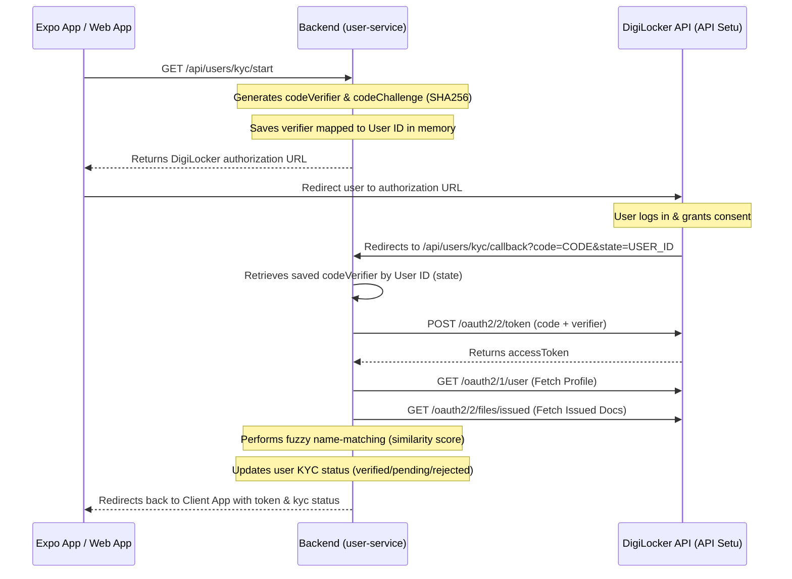

## 1. High-Level Flow Overview

The KYC verification process uses **OAuth 2.0 with PKCE (Proof Key for Code Exchange)**. Here is how the web app currently executes it:



---

## 2. Existing Backend Endpoints

The mobile app must communicate with the following user-service endpoints:

### A. Initiate KYC

- **Endpoint**: `GET /api/users/kyc/start`
- **Headers**: `Authorization: Bearer <JWT_TOKEN>`
- **Response**:
  ```json
  {
    "url": "https://digilocker.meripehchaan.gov.in/public/oauth2/1/authorize?response_type=code&client_id=...&redirect_uri=...&scope=openid&state=USER_ID&code_challenge=...&code_challenge_method=S256"
  }
  ```

### B. Update KYC Details (For Retries)

If a user's KYC is rejected or needs updates:

- **Endpoint**: `PATCH /api/users/kyc/details`
- **Headers**: `Authorization: Bearer <JWT_TOKEN>`
- **Body**:
  ```json
  {
    "name": "Correct Name per Aadhaar",
    "email": "user@example.com",
    "pincode": "123456",
    "locality": "Area Name",
    "city": "City Name",
    "state": "State Name"
  }
  ```
- **Response**: Returns a new JWT token and resets user state to `kyc_pending`.

### C. The Redirect (Callback Handler)

- **Endpoint**: `GET /api/users/kyc/callback`
- **Process**: DigiLocker sends the authentication `code` and `state` to this backend route. The backend completes the exchange, verifies the user, updates the database, and redirects the client back using:
  ```
  ${process.env.FRONTEND_URL}/?token=${jwtToken}&kyc=${kycStatus}&remark=${remarks}
  ```

---

## 3. Expo Integration Strategies

Since the backend is currently configured to redirect to the Web Frontend URL (`process.env.FRONTEND_URL`), you have two ways to integrate this in the Expo mobile app:

### Option A: In-App WebView (Easiest, No Backend Changes)

You can render the DigiLocker login page inside a React Native modal using `react-native-webview`. The app listens to URL changes. When it detects the redirect to the web app, it intercepts the URL, extracts the query params, saves the token, and closes the modal.

#### Installation

```bash
npx expo install react-native-webview
```

#### Expo Component Code (`KycWebViewModal.tsx`)

```tsx
import React from "react";
import {
  StyleSheet,
  Modal,
  SafeAreaView,
  TouchableOpacity,
  Text,
  View,
} from "react-native";
import { WebView, WebViewNavigation } from "react-native-webview";

interface KycWebViewModalProps {
  visible: boolean;
  authUrl: string;
  frontendUrl: string; // Match process.env.FRONTEND_URL (e.g., 'https://propenu.com' or dev server)
  onSuccess: (data: {
    token: string;
    kycStatus: string;
    remark: string;
  }) => void;
  onFailure: (errorMsg: string) => void;
  onClose: () => void;
}

export default function KycWebViewModal({
  visible,
  authUrl,
  frontendUrl,
  onSuccess,
  onFailure,
  onClose,
}: KycWebViewModalProps) {
  const handleNavigationStateChange = (navState: WebViewNavigation) => {
    const { url } = navState;

    // Check if the URL matches the frontend redirect URL
    if (
      url.startsWith(frontendUrl) ||
      (url.includes("token=") && url.includes("kyc="))
    ) {
      try {
        // Parse query parameters
        const queryString = url.split("?")[1];
        if (queryString) {
          const params = new URLSearchParams(queryString);
          const token = params.get("token");
          const kycStatus = params.get("kyc");
          const remark = params.get("remark") || "";

          if (token && kycStatus) {
            onSuccess({
              token,
              kycStatus,
              remark: decodeURIComponent(remark),
            });
            return;
          }
        }

        if (url.includes("kyc=failed")) {
          onFailure("KYC verification failed during authorization.");
        }
      } catch (error) {
        onFailure("Error parsing KYC response parameters.");
      }
    }
  };

  return (
    <Modal
      visible={visible}
      animationType="slide"
      presentationStyle="pageSheet"
      onRequestClose={onClose}
    >
      <SafeAreaView style={styles.container}>
        <View style={styles.header}>
          <Text style={styles.title}>DigiLocker KYC Verification</Text>
          <TouchableOpacity onPress={onClose} style={styles.closeButton}>
            <Text style={styles.closeButtonText}>Cancel</Text>
          </TouchableOpacity>
        </View>

        <WebView
          source={{ uri: authUrl }}
          onNavigationStateChange={handleNavigationStateChange}
          javaScriptEnabled={true}
          domStorageEnabled={true}
          startInLoadingState={true}
          style={{ flex: 1 }}
        />
      </SafeAreaView>
    </Modal>
  );
}

const styles = StyleSheet.create({
  container: {
    flex: 1,
    backgroundColor: "#fff",
  },
  header: {
    height: 50,
    borderBottomWidth: 1,
    borderBottomColor: "#eee",
    flexDirection: "row",
    alignItems: "center",
    justifyContent: "space-between",
    paddingHorizontal: 15,
  },
  title: {
    fontSize: 16,
    fontWeight: "bold",
    color: "#333",
  },
  closeButton: {
    padding: 5,
  },
  closeButtonText: {
    color: "#e74c3c",
    fontSize: 14,
    fontWeight: "600",
  },
});
```

---

### Option B: Expo WebBrowser & Deep Linking (Production Best Practice)

Instead of a WebView, you can open a secure system browser session. This is cleaner and more secure. To do this, we need to handle deep linking back to the mobile app.

#### 1. Setup Custom URL Scheme in Expo

Add the scheme to your `app.json`:

```json
{
  "expo": {
    "scheme": "propenu"
  }
}
```

#### 2. Option B1: Simple Frontend Redirect Bridge

Keep the backend as is (no changes). When the browser redirects to the website, the website can detect if it's a mobile redirect (e.g. by adding a check in `TokenHandler.tsx`) and redirect to the deep link:

```ts
// Inside TokenHandler.tsx, if we detect mobile flags or cookies:
window.location.href = `propenu://kyc-callback?token=${token}&kyc=${kyc}&remark=${remark}`;
```

#### 3. Option B2: Dynamic Backend Redirect (Requires Minor Backend Edits)

Modify `/api/users/kyc/start` to accept a platform query: `GET /api/users/kyc/start?platform=mobile`.

1. Save `platform=mobile` mapping in the verifier memory store alongside the `codeVerifier`.
2. In `callbackKyc` in `kycController.ts`, check the platform:

   ```typescript
   const platform = await getPlatform(state); // 'mobile' | 'web'

   if (platform === "mobile") {
     const redirectUrl = `propenu://kyc-callback?token=${jwtToken}&kyc=${kycStatus}&remark=${encodeURIComponent(remarks)}`;
     return res.redirect(redirectUrl);
   } else {
     return res.redirect(
       `${process.env.FRONTEND_URL}/?token=${jwtToken}&kyc=${kycStatus}...`,
     );
   }
   ```

#### 4. React Native Implementation with `expo-web-browser`

```typescript
import * as WebBrowser from "expo-web-browser";
import * as Linking from "expo-linking";
import AsyncStorage from "@react-native-async-storage/async-storage"; // or SecureStore

// Register callback listener
WebBrowser.maybeCompleteAuthSession();

export async function handleKycVerification() {
  try {
    // 1. Call your API to start KYC
    const response = await fetch(
      "https://api.propenu.com/api/users/kyc/start",
      {
        headers: {
          Authorization: `Bearer ${await AsyncStorage.getItem("token")}`,
        },
      },
    );
    const { url } = await response.json();

    // 2. Open auth session. Under Option B1, the website redirects to propenu://kyc-callback
    const redirectUrl = Linking.createURL("kyc-callback"); // e.g. propenu://kyc-callback

    const result = await WebBrowser.openAuthSessionAsync(url, redirectUrl);

    if (result.type === "success" && result.url) {
      // 3. Extract tokens from deep link url
      const parsed = Linking.parse(result.url);
      const { token, kyc, remark } = parsed.queryParams as {
        token?: string;
        kyc?: string;
        remark?: string;
      };

      if (token && kyc) {
        await AsyncStorage.setItem("token", token);
        return { success: true, kyc, remark };
      }
    }

    return { success: false, error: "User cancelled or verification failed." };
  } catch (error) {
    console.error("KYC launch error:", error);
    return { success: false, error: error.message };
  }
}
```

---

## 4. Key Rules for KYC Status Mapping

When you receive the callback parameters in the Expo app, map them to your UI states:

| `kyc` parameter | UI State to display                | Description                                                                   |
| :-------------- | :--------------------------------- | :---------------------------------------------------------------------------- |
| `verified`      | **KYC Verified** (Green badge)     | Identity matches Aadhaar. App state becomes `active`.                         |
| `pending`       | **KYC Pending** (Yellow badge)     | Similarity score is between 0.4 and 0.6. Requires manual admin approval.      |
| `rejected`      | **KYC Failed / Retry** (Red badge) | Name mismatch. Display `remark` explanation and show "Update Details" button. |

---

## 5. Helpful Backend State Transitions to Check

During KYC flow development, refer to:

- **Models**: `kyc.provider`, `kyc.status`, `kyc.remarks`, `kyc.verifiedName`, `kyc.verifiedDob` under [userModel.ts](file:///Users/mbair15/propenu-web/backend/services/user-service/src/models/userModel.ts).
- **Fuzzy score logic**: Located in [kycController.ts](file:///Users/mbair15/propenu-web/backend/services/user-service/src/controller/kycController.ts) (Jaro-Winkler name similarity with threshold checks for 0.8 / 0.6 / 0.4 scores).
